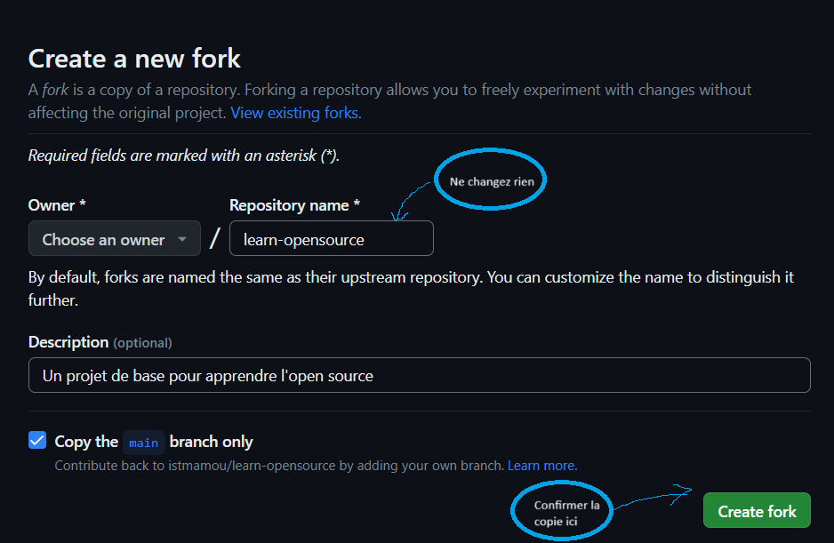

# Découvrez l'Open Source
Dans ce README, nous vous montrons les premiers pas vers l'opensource et la contribution en ligne. Ainsi que les outils qui sont utilisés pour faire de l'opensource.

Vous avez envie de savoir de quoi nous vous parlons, jetez un coup d'oeil à [cette galerie](https://istmamou.github.io/learn-opensource) et si ça vous dit d'y ajouter votre identité, c'est parti !
# C'est quoi l'Open Source
L'Open Source est une méthode de développement de logiciels qui permet à des personnes du monde entier de collaborer sur des projets. Les projets Open Source sont accessibles à tous et peuvent être utilisés, modifiés et redistribués librement.

L'Open Source encourage la collaboration et la transparence, ce qui peut conduire à des logiciels de meilleure qualité et plus innovants. Il permet également aux développeurs d'apprendre des autres et de partager leurs connaissances.
# Comment faire ?

Principalement, ce guide pratique vous donne les outillages nécessaires pour vos premies pas.

## Installations et configuration
### Télécharger Git et l'installer
Le lien de téléchagement est le suivant: https://git-scm.com/downloads

L'installation de Git ressemble à l'installation de n'importe quel logiciel.
Seulement prêtez attention à ajouter Git aux variables d'environnement pour permettre de l'exécuter depuis la console de commandes.

### Télécharger un éditeur de code
Pour faire nos premiers pas dans la collaboration, nous aurons besoin d'un éditeur de texte qui va nous permettre de travailler efficacement

Téléchargez **Visual Studio Code** ici: https://code.visualstudio.com/Download

### Faites vos premiers tests pour vérifier l'installation
1. Ouvrir une console de commande avec `Windows + R` et vous tapez `CMD` puis `Enter`.
2. Tapez la commande `git --version`, vous devriez avoir le même résultat que ceci:


### Configuration
On va faire quelques configurations essentielles
1. Le nom d'utilisateur
```powershell
git config --global user.name "<Votre nom complet>"
```

2. L'adresse email
```powershell
git config --global user.email <Votre adresse email>
```

Comme ça, toutes les modifications faites seront enregistrées en votre nom, ce qui facilite la traçabilité des changements!

### Créer un compte Github
Rendez-vous sur [https://github.com](https://github.com) et créez votre compte personnel ! N'oubliez pas de choisir un nom d'utilisateur original et un mot de passe pas facile à déviner.

Si vous avez déjà un compte github, c'est parfait, connectez-vous et rendez-vous à l'étape suivante.

### Liaison Git et Github
Afin de publier vos collaborations, vos projets sur github, cette partie est essentielle.

Mais nous on va utiliser le protocole `https://` pour plus de facilité (mais ce n'est point le moyen le plus sécurisé !).

Donc on va donc attendre notre premier push pour nous authentifier à ce moment-là !

## Premiers pas
### Copier le projet sur votre espace
La première chose à faire quand on fait de la contribution sur un projet, va consister à copier le projet sur votre espace personnel Github. Dans le jargon, il s'agit de faire un **fork** du projet, autrement, vous allez avoir une copie du repository sur votre espace personnel à vous.

Faire un fork est simple, étant que nous travaillons sur [ce projet](https://github.com/istmamou/learn-opensource), vous rester sur la page actuelle.

Ensuite cliquer sur l'option `fork`


Puis on vous demande le nom du repo, laissez comme tel sans rien changer



A ce moment, comme il est expliqué sur l'image, vous serez libres d'effectuer des modifications au niveau de votre espace personnel sans pour autant affecter le projet principal. C'est là que ça devient intéressant car chaque collaborateur peut faire des changements sans affecter le travail d'un autre.

### Cloner le projet sur votre machine personnelle
Il s'agit simplement de télécharger le code sur votre machine à vous.
Alors ce qu'on va faire c'est simplement lancer une commande et puis le tour sera joué.

> Remplacez &lt;username&gt; par votre nom d'utilisateur github.

```powersheell
git clone https://github.com/<username>/learn-opensource
```

Puis par après

```powersheell
cd learn-opensource
```

Grâce à la première commande, vous récupérez tous le code sur le repo sur votre machine personnelle à vous, vous permettant ainsi d'y apporter des modifications et puis de les uploader par après. La deuxième commande quant à elle vous permet de vous déplacer dans le dossier du projet.

## Apporter votre contribution
Il est temps d'apporter votre contribution, mais pour ce faire, il faut commencer par créer une branche

### Les branches

|Fonctionnalité|Commande|
|-|-|
|Lister les branches|`git branch`|
|Créer une branche|`git branch <nom de la branche>`|
|Changer de branche|`git checkout <nom de la branche>`|
|Créer une branche et s'y déplacer en même temps|`git checkout -b <nom de la branche>`|
|Supprimer une branche|`git branch -d <nom de la branche>`|
|Rénommer une branche|`git branch -m <ancien nom de la branche> <nouveau nom de la branche>`|


### Premiers pas
Créer une branche :

```powersheell
git checkout main
git checkout -b ajout-participant

```

L'arborescence du projet est comme suit:
```
./
    assets/
        images/
            ...
        ...
    participants/
        _sample.md
        ...
    index.html
    README.md
    styles.css
```

Copiez-collez le contenu du fichier `participants/_sample.md` et renomez le fichier en mettant `<username>.md`
> Remplacez &lt;username&gt; par votre nom d'utilisateur github.

Ensuite, vous allez remplir tous les champs qui existent par défaut par vos informations à vous

Collez votre image personnelle dans le dossier `assets/images/` en le renommant `<username>`, les extentions optimales sont `png|jpg|jpeg`.

Ensuite, copiez-collez le code-ci dans le fichier `index.html` à l'emplacement indiqué en prenant soin de modifier l'identifiant de la card par votre numéro d'arriver.

```html
<!-- Copiez de là  -->
<div data-aos="zoom-in" class="card">
    <!-- Remplacez le numéro de la card dans l'attribut id -->
    <div id="card1" class="image"></div> 
    <div class="line"></div>
    <div class="infos">
        <h3 class="fullname">Mamadou Moustapha Diallo</h3>
        <div>Designer</div>
        <div class="links">
            <!-- Mettez votre lien github ci-dessous dans l'attribut href="https://github.com/<GITHUB_USERNAME>" -->
            <a href="https://github.com/moustaphaotf" target="_blank"> <svg xmlns="http://www.w3.org/2000/svg"
                width="24" height="24" viewBox="0 0 24 24">
                <mask id="lineMdGithubLoop0" width="24" height="24" x="0" y="0">
                    <g fill="#fff">
                    <ellipse cx="9.5" cy="9" rx="1.5" ry="1" />
                    <ellipse cx="14.5" cy="9" rx="1.5" ry="1" />
                    </g>
                </mask>
                <g fill="none" stroke="black" stroke-linecap="round" stroke-linejoin="round" stroke-width="2">
                    <path stroke-dasharray="30" stroke-dashoffset="30"
                    d="M12 4C13.6683 4 14.6122 4.39991 15 4.5C15.5255 4.07463 16.9375 3 18.5 3C18.8438 4 18.7863 5.21921 18.5 6C19.25 7 19.5 8 19.5 9.5C19.5 11.6875 19.017 13.0822 18 14C16.983 14.9178 15.8887 15.3749 14.5 15.5C15.1506 16.038 15 17.3743 15 18C15 18.7256 15 21 15 21M12 4C10.3317 4 9.38784 4.39991 9 4.5C8.47455 4.07463 7.0625 3 5.5 3C5.15625 4 5.21371 5.21921 5.5 6C4.75 7 4.5 8 4.5 9.5C4.5 11.6875 4.98301 13.0822 6 14C7.01699 14.9178 8.1113 15.3749 9.5 15.5C8.84944 16.038 9 17.3743 9 18C9 18.7256 9 21 9 21">
                    <animate fill="freeze" attributeName="stroke-dashoffset" dur="0.6s" values="30;0" />
                    </path>
                    <path stroke-dasharray="10" stroke-dashoffset="10" d="M9 19">
                    <animate fill="freeze" attributeName="stroke-dashoffset" begin="0.7s" dur="0.2s" values="10;0" />
                    <animate attributeName="d" dur="3s" repeatCount="indefinite"
                        values="M9 19c-1.406 0-2.844-.563-3.688-1.188C4.47 17.188 4.22 16.157 3 15.5;M9 19c-1.406 0-3-.5-4-.5-.532 0-1 0-2-.5;M9 19c-1.406 0-2.844-.563-3.688-1.188C4.47 17.188 4.22 16.157 3 15.5" />
                    </path>
                </g>
                <rect width="8" height="4" x="8" y="11" fill="black" mask="url(#lineMdGithubLoop0)">
                    <animate attributeName="y" dur="10s" keyTimes="0;0.45;0.46;0.54;0.55;1" repeatCount="indefinite"
                    values="11;11;7;7;11;11" />
                </rect>
                </svg>
            </a>

            <!-- Mettez votre lien linkedin ci-dessous dans l'attribut href="https://www.linkedin.com/in/<LINKEDIN_USERNAME>" -->
            <a href="https://www.linkedin.com/in/moustaphaotf/" target="_blank"><svg
                xmlns="http://www.w3.org/2000/svg" width="24" height="24" viewBox="0 0 24 24">
                <circle cx="4" cy="4" r="2" fill="#0a66c2" fill-opacity="0">
                <animate fill="freeze" attributeName="fill-opacity" dur="0.4s" values="0;1" />
                </circle>
                <g fill="none" stroke="#0a66c2" stroke-linecap="round" stroke-width="4">
                <path stroke-dasharray="12" stroke-dashoffset="12" d="M4 10V20">
                    <animate fill="freeze" attributeName="stroke-dashoffset" begin="0.2s" dur="0.2s" values="12;0" />
                </path>
                <path stroke-dasharray="12" stroke-dashoffset="12" d="M10 10V20">
                    <animate fill="freeze" attributeName="stroke-dashoffset" begin="0.5s" dur="0.2s" values="12;0" />
                </path>
                <path stroke-dasharray="24" stroke-dashoffset="24"
                    d="M10 15C10 12.2386 12.2386 10 15 10C17.7614 10 20 12.2386 20 15V20">
                    <animate fill="freeze" attributeName="stroke-dashoffset" begin="0.7s" dur="0.5s" values="24;0" />
                </path>
                </g>
            </svg></a>
        </div>
    </div>
</div>

<!-- Jusqu'ici -->

<!-- Et collez en bas -->
```

Enfin, nous ouvrir le fichier `styles.css` et ajouter cette ligne à l'emplacement indiqué dans le code:
```
#cardn {
    background: url("./assets/images/<profile image>");
} 

```

> Remplacez &lt;profile image&gt; par le nom de votre image. Et le n du sélecteur par votre numéro personnel. Ne confondez pas avec celui d'un autre.


Vous pouvez déjà tester le rendu sur votre navigateur en ouvrant le fichier `index.html`.

## Enregistrer les modifications sur git
